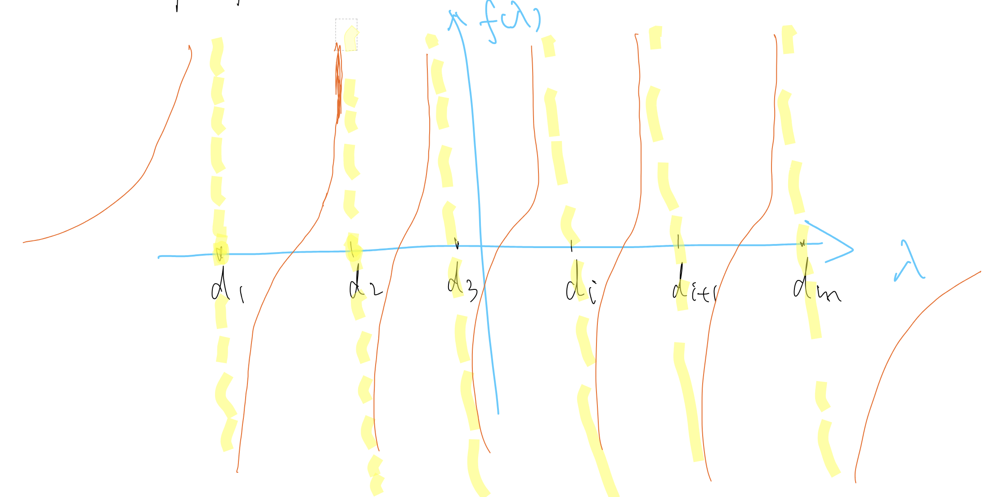

# Divide and Conquer

Assume $\boldsymbol{A}\in \mathbb{R} ^{m\times m}$ is SPD. After phase 1, $\boldsymbol{T}=\left( \hat{\boldsymbol{Q}}^{\left( 0 \right)} \right) ^T\boldsymbol{A}\hat{\boldsymbol{Q}}^{\left( 0 \right)}$ where $\boldsymbol{T}$ is tridiagonal ( $\boldsymbol{T}$ is also SPD ).

`Main Idea`: Split the matrix into smaller matrices *in size*, and find the eigenvalues in a recursive manner (surgical strategy).

Let:

$$
\boldsymbol{T}=\left[ \begin{matrix}
	\boldsymbol{T}_1&		&		&		\\
	&		&		\beta&		\\
	&		\beta&		&		\\
	&		&		&		\boldsymbol{T}_2\\
\end{matrix} \right] 
$$

where $\boldsymbol{T}_1\in \mathbb{R} ^{n\times n},\boldsymbol{T}_2\in \mathbb{R} ^{\left( m-n \right) \times \left( m-n \right)}$. Usually select $n\sim \frac{m}{2}$. We either take $n=\lfloor \frac{m}{2} \rfloor$ or $n=\lceil \frac{m}{2} \rceil$.

Let $\beta =t_{n+1,n}=t_{n,n+1}$. We can rewrite $\boldsymbol{T}$ as:

$$
\boldsymbol{T}=\left[ \begin{matrix}
	\hat{\boldsymbol{T}}_1&		\boldsymbol{O}\\
	\boldsymbol{O}&		\hat{\boldsymbol{T}}_2\\
\end{matrix} \right] +\left[ \begin{matrix}
	\boldsymbol{O}&		&		&		\boldsymbol{O}\\
	&		\beta&		\beta&		\\
	&		\beta&		\beta&		\\
	\boldsymbol{O}&		&		&		\boldsymbol{O}\\
\end{matrix} \right] 
$$

$$
\left( \hat{\boldsymbol{T}}_1 \right) _{nn}=\left( \boldsymbol{T}_1 \right) _{nn}-\beta ;
\\
\left( \hat{\boldsymbol{T}}_2 \right) _{11}=\left( \boldsymbol{T}_2 \right) _{11}-\beta 
$$

We can get:

$$
\boldsymbol{T}=\hat{\boldsymbol{T}}+\left[ \begin{array}{c}
	0\\
	\vdots\\
	0\\
	\sqrt{\beta}\\
	\sqrt{\beta}\\
	0\\
	\vdots\\
	0\\
\end{array} \right] \cdot \left[ \begin{matrix}
	0&		\cdots&		0&		\sqrt{\beta}&		\sqrt{\beta}&		0&		\cdots&		0\\
\end{matrix} \right] \triangleq \hat{\boldsymbol{T}}+\boldsymbol{z}\cdot \boldsymbol{z}^T
$$

Therefore: $\boldsymbol{T}=\hat{\boldsymbol{T}}+\boldsymbol{z}\cdot \boldsymbol{z}^T$.

***Question***: Assume that we know the eigenvalues of $\hat{\boldsymbol{T}}_1$ and $\hat{\boldsymbol{T}}_2$, how to find the eigenvalues of $\boldsymbol{T}$ ?

Denote $\hat{\boldsymbol{T}}_1=\boldsymbol{Q}_1\boldsymbol{D}_1{\boldsymbol{Q}_1}^T$ as the eigenvalue decomposition for $\hat{\boldsymbol{T}}_1$. $\boldsymbol{Q}_1$ contains the eigenvectors of $\hat{\boldsymbol{T}}_1$. $\boldsymbol{D}_1$ is a diagonal matrix whose diagonal elements are the eigenvalues. Also $\hat{\boldsymbol{T}}_2=\boldsymbol{Q}_2\boldsymbol{D}_2{\boldsymbol{Q}_2}^T$.

Let us denote the last row of $\boldsymbol{Q}_1$ as ${\boldsymbol{q}_1}^T$, and the first row of $\boldsymbol{Q}_2$ as ${\boldsymbol{q}_2}^T$. Also denote $\boldsymbol{v}=\left[ {\boldsymbol{q}_1}^T,{\boldsymbol{q}_2}^T \right] ^T$.

`Theorem`: $\boldsymbol{T}$ is similar to $\left[ \begin{matrix}
	\boldsymbol{D}_1&		\boldsymbol{O}\\
	\boldsymbol{O}&		\boldsymbol{D}_2\\
\end{matrix} \right] +\beta \boldsymbol{vv}^T$.

`Proof`: Define $\boldsymbol{Q}=\left[ \begin{matrix}
	\boldsymbol{Q}_1&		\boldsymbol{O}\\
	\boldsymbol{O}&		\boldsymbol{Q}_2\\
\end{matrix} \right]$

$$
\boldsymbol{Q}\left( \left[ \begin{matrix}
	\boldsymbol{D}_1&		\boldsymbol{O}\\
	\boldsymbol{O}&		\boldsymbol{D}_2\\
\end{matrix} \right] +\beta \boldsymbol{vv}^T \right) \boldsymbol{Q}^T
$$

$$
=\left[ \begin{matrix}
	\boldsymbol{Q}_1\boldsymbol{D}_1{\boldsymbol{Q}_1}^T&		\boldsymbol{O}\\
	\boldsymbol{O}&		\boldsymbol{Q}_2\boldsymbol{D}_2{\boldsymbol{Q}_2}^T\\
\end{matrix} \right] +\beta \left[ \begin{matrix}
	\boldsymbol{Q}_1&		\boldsymbol{O}\\
	\boldsymbol{O}&		\boldsymbol{Q}_2\\
\end{matrix} \right] \left[ \begin{array}{c}
	\boldsymbol{q}_1\\
	\boldsymbol{q}_2\\
\end{array} \right] \left[ \begin{matrix}
	{\boldsymbol{q}_1}^T&		{\boldsymbol{q}_2}^T\\
\end{matrix} \right] \left[ \begin{matrix}
	{\boldsymbol{Q}_1}^T&		\boldsymbol{O}\\
	\boldsymbol{O}&		{\boldsymbol{Q}_2}^T\\
\end{matrix} \right] 
$$

$$
=\left[ \begin{matrix}
	\hat{\boldsymbol{T}}_1&		\boldsymbol{O}\\
	\boldsymbol{O}&		\hat{\boldsymbol{T}}_2\\
\end{matrix} \right] +\beta \left[ \begin{array}{c}
	\boldsymbol{Q}_1\boldsymbol{q}_1\\
	\boldsymbol{Q}_2\boldsymbol{q}_2\\
\end{array} \right] \left[ \begin{matrix}
	{\boldsymbol{q}_1}^T{\boldsymbol{Q}_1}^T&		{\boldsymbol{q}_2}^T{\boldsymbol{Q}_2}^T\\
\end{matrix} \right] 
$$

$$
=\left[ \begin{matrix}
	\hat{\boldsymbol{T}}_1&		\boldsymbol{O}\\
	\boldsymbol{O}&		\hat{\boldsymbol{T}}_2\\
\end{matrix} \right] +\beta \left[ \begin{array}{c}
	0\\
	\vdots\\
	0\\
	1\\
	1\\
	0\\
	\vdots\\
	0\\
\end{array} \right] \cdot \left[ \begin{matrix}
	0&		\cdots&		0&		1&		1&		0&		\cdots&		0\\
\end{matrix} \right] =\left[ \begin{matrix}
	\hat{\boldsymbol{T}}_1&		\boldsymbol{O}\\
	\boldsymbol{O}&		\hat{\boldsymbol{T}}_2\\
\end{matrix} \right] +\boldsymbol{zz}^T
$$

which is $\boldsymbol{T}$.

***Question***: What are the eigenvalues for $\left[ \begin{matrix}
	\boldsymbol{D}_1&		\boldsymbol{O}\\
	\boldsymbol{O}&		\boldsymbol{D}_2\\
\end{matrix} \right] +\beta \boldsymbol{vv}^T$ ?

Define $\boldsymbol{w}=\sqrt{\beta}\boldsymbol{v}$, then $\beta \boldsymbol{vv}^T=\boldsymbol{ww}^T$. What are the eigenvalues for $\left[ \begin{matrix}
	\boldsymbol{D}_1&		\boldsymbol{O}\\
	\boldsymbol{O}&		\boldsymbol{D}_2\\
\end{matrix} \right] +\boldsymbol{ww}^T$ ?

`Claim`: $\boldsymbol{w}\ne 0$. This is because $\boldsymbol{v}=\left[ \begin{array}{c}
	\boldsymbol{q}_1\\
	\boldsymbol{q}_2\\
\end{array} \right]$ where $\boldsymbol{q}_1$ and $\boldsymbol{q}_2$ are eigenvectors corresponding to $\hat{\boldsymbol{T}}_1,\hat{\boldsymbol{T}}_2$.

We can further assume that $w_i\ne 0,\left( \forall i \right)$. If not, $\boldsymbol{w}=\left[ \begin{array}{c}
	w_1\\
	\vdots\\
	w_{i-1}\\
	0\\
	w_{i+1}\\
	\vdots\\
	w_m\\
\end{array} \right]$ and we can break the problem into two smaller problems (in size) and continue the procedure.

Let $\left[ \begin{matrix}
	\boldsymbol{D}_1&		\boldsymbol{O}\\
	\boldsymbol{O}&		\boldsymbol{D}_2\\
\end{matrix} \right] \triangleq \boldsymbol{D}$ for simplicity.

`Theorem` (***important***): The eigenvalues of $\boldsymbol{D}+\boldsymbol{ww}^T$ are the roots of the following rational function:

$$
f\left( \lambda \right) =1+\boldsymbol{w}^T\left( \boldsymbol{D}-\lambda \mathbf{I} \right) ^{-1}\boldsymbol{w},
\\
\boldsymbol{D}=\mathrm{diag}\left( d_1,d_2,\cdots ,d_m \right) ;
$$

$$
f\left( \lambda \right) =1+\sum_{j=1}^m{\frac{{w_j}^2}{d_j-\lambda}}
$$

`Proof`: If $\left( \boldsymbol{D}+\boldsymbol{ww}^T \right) \boldsymbol{q}=\lambda \boldsymbol{q}$ for $\boldsymbol{q}\ne 0$, we want to show that $f(\lambda )=0$.

Rewrite the equation as $\left( \boldsymbol{D}-\lambda \mathbf{I} \right) \boldsymbol{q}+\boldsymbol{w}\left( \boldsymbol{w}^T\boldsymbol{q} \right) =0$. Assume $\boldsymbol{D}-\lambda \mathbf{I}$ is invertible (Why can we assume it is invertible?), then:

$$
\boldsymbol{q}+\left( \boldsymbol{D}-\lambda \mathbf{I} \right) ^{-1}\boldsymbol{w}\left( \boldsymbol{w}^T\boldsymbol{q} \right) =0;
$$

$$
\boldsymbol{w}^T\boldsymbol{q}+\boldsymbol{w}^T\left( \boldsymbol{D}-\lambda \mathbf{I} \right) ^{-1}\boldsymbol{w}\left( \boldsymbol{w}^T\boldsymbol{q} \right) =0
$$

Since $\boldsymbol{w}^T\boldsymbol{q}$ is a scalar, then:

$$
\left( 1+\boldsymbol{w}^T\left( \boldsymbol{D}-\lambda \mathbf{I} \right) ^{-1}\boldsymbol{w} \right) \cdot \left( \boldsymbol{w}^T\boldsymbol{q} \right) =0;
\\
\Longrightarrow f\left( \lambda \right) \cdot \left( \boldsymbol{w}^T\boldsymbol{q} \right) =0
$$

If $\boldsymbol{w}^T\boldsymbol{q} \ne 0$, then we must have $f(\lambda )=0$; If $\boldsymbol{w}^T\boldsymbol{q}=0$, then:

$$
\lambda \boldsymbol{q}=\left( \boldsymbol{D}+\boldsymbol{ww}^T \right) \boldsymbol{q}=\boldsymbol{Dq}+\boldsymbol{w}\left( \boldsymbol{w}^T\boldsymbol{q} \right) =\boldsymbol{Dq}
$$

This means that $\boldsymbol{q}$ is an eigenvector of $\boldsymbol{D}$. $\boldsymbol{D}$ is diagonal, then $\boldsymbol{q}$ must be $\boldsymbol{e}_i,1\leqslant i\leqslant m$. $0=\boldsymbol{w}^T\boldsymbol{q}=\boldsymbol{w}^T\boldsymbol{e}_i=w_i$ and we get the contradiction. This shows that $\boldsymbol{w}^T\boldsymbol{q}\ne 0\Longrightarrow f\left( \lambda \right) =0$.

The ***converse*** is also true: If $\lambda$ is a root of $f(\lambda )=0$, then $\lambda$ is an eigenvalue of $\boldsymbol{D}+\boldsymbol{ww}^T$.

The **properties** of $f(\lambda )$: The roots of $f(\lambda )=0$ can be computed easily by many iterative methods, such as Newton's method because they are well separated and have no flat region.

We always have root ${\lambda}_i$ in $(d_i ,d_{i+1})$:

$$
{\lambda _i}^{\left( 0 \right)}=\frac{1}{2}\left( d_i+d_{i+1} \right) ;
\\
{\lambda _i}^{\left( k+1 \right)}={\lambda _i}^{\left( k \right)}-\frac{f\left( {\lambda _i}^{\left( k \right)} \right)}{f\prime\left( {\lambda _i}^{\left( k \right)} \right)};
$$

$$
k\rightarrow +\infty : {\lambda _i}^{\left( k \right)}\rightarrow \lambda _i
$$

