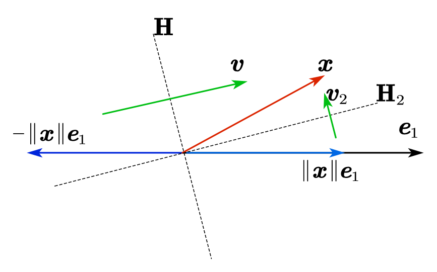

# QR Factorization

Definition of QR Factorization:

$$
\boldsymbol{A}=\boldsymbol{Q}\cdot \boldsymbol{R}
$$

$\boldsymbol{Q}$ is a unitary matrix and $\boldsymbol{R}$ is an upper triangular matrix.

## Gram-Schmidt Algorithm

### Introduction to Gram-Schmidt Process

**Gram-Schmidt** is an algorithm to produce $\boldsymbol{Q}$ and $\boldsymbol{R}$.

Given $\left[ \begin{matrix}
	\boldsymbol{a}_1&		\boldsymbol{a}_2&		\cdots&		\boldsymbol{a}_m\\
\end{matrix} \right]$. Let $\mathrm{span}\left\{ \boldsymbol{a}_1, \boldsymbol{a}_2, \cdots , \boldsymbol{a}_m \right\} \triangleq \left< \boldsymbol{a}_1, \boldsymbol{a}_2, \cdots , \boldsymbol{a}_m \right>$. We need to find $\boldsymbol{q}_1, \boldsymbol{q}_2, \cdots , \boldsymbol{q}_m$ such that $\left< \boldsymbol{q}_1, \boldsymbol{q}_2, \cdots , \boldsymbol{q}_m \right> =\left< \boldsymbol{a}_1, \boldsymbol{a}_2, \cdots , \boldsymbol{a}_m \right>$ and the inner products $\left( \boldsymbol{q}_i, \boldsymbol{q}_j \right) =0$ if $i\ne j$, $\left( \boldsymbol{q}_i, \boldsymbol{q}_i \right) =1$.

Example steps (only 2-norm is used below):

$$
\boldsymbol{q}_1=\frac{\boldsymbol{a}_1}{\left\| \boldsymbol{a}_1 \right\|}, r_{11}=\left\| \boldsymbol{a}_1 \right\| \Longrightarrow \boldsymbol{q}_1=\frac{\boldsymbol{a}_1}{r_{11}}
$$

$$
r_{12}=\left( \boldsymbol{q}_1, \boldsymbol{a}_2 \right) , \boldsymbol{v}_2=\boldsymbol{a}_2-r_{12}\cdot \boldsymbol{q}_1, r_{22}=\left\| \boldsymbol{v}_2 \right\| 
\\
\Longrightarrow \boldsymbol{q}_2=\frac{\boldsymbol{v}_2}{r_{22}}
$$

$$
r_{13}=\left( \boldsymbol{q}_1, \boldsymbol{a}_3 \right) , r_{23}=\left( \boldsymbol{q}_2, \boldsymbol{a}_3 \right) , \boldsymbol{v}_3=\boldsymbol{a}_3-r_{13}\cdot \boldsymbol{q}_1-r_{23}\cdot \boldsymbol{q}_2, r_{33}=\left\| \boldsymbol{v}_3 \right\| 
\\
\Longrightarrow \boldsymbol{q}_3=\frac{\boldsymbol{v}_3}{r_{33}}
$$

### Classical Gram-Schmidt Algorithm

Given $\boldsymbol{A}=\left[ \begin{matrix}
	\boldsymbol{a}_1&		\cdots&		\boldsymbol{a}_j&		\cdots&		\boldsymbol{a}_m\\
\end{matrix} \right]$;

For $j=1:m$:

- $\boldsymbol{v}_j=\boldsymbol{a}_j$;
- For $i=1:(j-1)$:
    - $r_{ij}=\left( \boldsymbol{q}_i, \boldsymbol{a}_j \right)$;
    - $\boldsymbol{v}_j=\boldsymbol{v}_j-r_{ij}\cdot \boldsymbol{q}_i$;
- End
- $r_{jj}=\left\| \boldsymbol{v}_j \right\|$;
- $\boldsymbol{q}_j=\frac{\boldsymbol{v}_j}{r_{jj}}$;

End

The outcome: $\boldsymbol{Q}=\left[ \begin{matrix}
	\boldsymbol{q}_1&		\boldsymbol{q}_2&		\cdots&		\boldsymbol{q}_m\\
\end{matrix} \right]$ unitary, and $\boldsymbol{R}=\left[ r_{ij} \right]$ upper triangular.

`Claim`: The classical Gram-Schmidt algorithm above is not stable.

### Modified Gram-Schmidt Algorithm

Given $\boldsymbol{A}=\left[ \begin{matrix}
	\boldsymbol{a}_1&		\cdots&		\boldsymbol{a}_j&		\cdots&		\boldsymbol{a}_m\\
\end{matrix} \right]$;

For $i=1:m$:

- $\boldsymbol{v}_i=\boldsymbol{a}_i$;

End

For $i=1:m$:

- $r_{ii}=\left\| \boldsymbol{v}_i \right\|$;
- $\boldsymbol{q}_i=\frac{\boldsymbol{v}_i}{r_{ii}}$;
- For $j=(i+1):m$:
    - $r_{ij}=\left( \boldsymbol{q}_i, \boldsymbol{v}_j \right)$;
    - $\boldsymbol{v}_j=\boldsymbol{v}_j-r_{ij}\cdot \boldsymbol{q}_i$;
- End

End

`Claim`: The modified Gram-Schmidt algorithm is stable.

***Questions***:

1. Why classical and modified Gram-Schmidt are equivalent?
2. Intuitively, why is the classical one not stable, while the modified one stable?

The cost of the modified Gram-Schmidt is $O(2mn^2)$ for $\boldsymbol{A}\in \mathbb{R} ^{m\times n}$.

## Discussion on QR Factorization

`Theorem`: Every matrix $\boldsymbol{A}\in \mathbb{R} ^{m\times n}\,\,\left( m\geqslant n \right)$ has a QR Factorization.

If column vectors of $\boldsymbol{A}$ are linearly independent(full rank), then

$$
\left[ \boldsymbol{A} \right] _{m\times n}=\left[ \boldsymbol{Q} \right] _{m\times n}\cdot \left[ \boldsymbol{R} \right] _{n\times n}
$$

This is **Reduced QR Factorization**(default). The other one:

$$
\left[ \boldsymbol{A} \right] _{m\times n}=\underset{\boldsymbol{Q}}{\underbrace{\left[ {\boldsymbol{Q}_0}^{m\times n}|\cdots \right] _{m\times m}}}\cdot \underset{\boldsymbol{R}}{\underbrace{\left[ \begin{array}{c}
	{\boldsymbol{R}_0}^{n\times n}\\
	O\\
\end{array} \right] _{m\times n}}}
$$

is called **Full QR Factorization**(rarely used).

`Theorem`: If $\boldsymbol{A}\in \mathbb{R} ^{m\times n}\,\,\left( m\geqslant n \right)$ is full rank, the Reduced QR Factorization is **unique** if we require $r_{ii}>0, i=1,\cdots ,n$.

We can use QR Factorization to solve linear systems (least square solution):

$$
\boldsymbol{A}=\boldsymbol{QR}
$$

$$
\boldsymbol{Ax}=\boldsymbol{b}\Leftrightarrow \boldsymbol{QRx}=\boldsymbol{b}\Leftrightarrow \boldsymbol{Rx}=\boldsymbol{Q}^*\boldsymbol{b}
$$

Matrix explanation of Gram-Schmidt process (Using upper triangular matrices to generate orthogonal matrix):

$$
\boldsymbol{A}\cdot \underset{\boldsymbol{R}^{-1}}{\underbrace{\boldsymbol{R}_1\boldsymbol{R}_2\cdots \boldsymbol{R}_n}}=\boldsymbol{Q}
$$

Two types of orthogonal linear transformation:

1. **Rotation**
2. **Reflection**

Actually, there are other ways to computer QR Factorization using unitary matrices to generate upper triangular matrix (Using unitary transformation):

$$
\underset{\boldsymbol{Q}^{-1}}{\underbrace{\boldsymbol{Q}_n\boldsymbol{Q}_{n-1}\cdots \boldsymbol{Q}_1}}\cdot \boldsymbol{A}=\boldsymbol{R}
$$

where $\boldsymbol{Q}_i$ are unitary. There are two ways for this process: **Householder transformation** and **Givens rotation**.

## Householder Transformation

### Basic Steps

The overall procedure (recursive):

$$
\boldsymbol{A}=\left[ \begin{matrix}
	\times&		\times&		\times&		\times\\
	\times&		\times&		\times&		\times\\
	\times&		\times&		\times&		\times\\
	\times&		\times&		\times&		\times\\
\end{matrix} \right] \xrightarrow{\boldsymbol{Q}_1}\left[ \begin{matrix}
	\times&		\times&		\times&		\times\\
	0&		\times&		\times&		\times\\
	0&		\times&		\times&		\times\\
	0&		\times&		\times&		\times\\
\end{matrix} \right] \xrightarrow{\boldsymbol{Q}_2}
$$

$$
\left[ \begin{matrix}
	\times&		\times&		\times&		\times\\
	0&		\times&		\times&		\times\\
	0&		0&		\times&		\times\\
	0&		0&		\times&		\times\\
\end{matrix} \right] \xrightarrow{\boldsymbol{Q}_3}\left[ \begin{matrix}
	\times&		\times&		\times&		\times\\
	0&		\times&		\times&		\times\\
	0&		0&		\times&		\times\\
	0&		0&		0&		\times\\
\end{matrix} \right] =\boldsymbol{R}
$$

**Example step 1**:

$$
\boldsymbol{x}_{\left( \mathrm{first} \mathrm{column} \right)}=\left[ \begin{array}{c}
	\times\\
	\times\\
	\times\\
	\times\\
\end{array} \right] \xrightarrow{\boldsymbol{Q}_1}\left[ \begin{array}{c}
	\times\\
	0\\
	0\\
	0\\
\end{array} \right] 
$$

where $\boldsymbol{Q}_1$ is unitary.

We can get:

$$
\boldsymbol{v}=-\left\| \boldsymbol{x} \right\| \boldsymbol{e}_1-\boldsymbol{x}, \boldsymbol{v}\bot \mathbf{H}
$$

$$
\boldsymbol{Q}_1=\boldsymbol{I}-2\cdot \frac{\boldsymbol{v}\cdot \boldsymbol{v}^*}{\boldsymbol{v}^*\boldsymbol{v}}
$$

$$
\boldsymbol{Q}_1\boldsymbol{x}=-\left\| \boldsymbol{x} \right\| \boldsymbol{e}_1
$$

`Question`: why not choose $\mathbf{H}_2$ and get $\boldsymbol{v}=\left\| \boldsymbol{x} \right\| \boldsymbol{e}_1-\boldsymbol{x}$?

We have two choices: $\boldsymbol{Q}_1\boldsymbol{x}=-\left\| \boldsymbol{x} \right\| \boldsymbol{e}_1, \boldsymbol{Q}_1\boldsymbol{x}=\left\| \boldsymbol{x} \right\| \boldsymbol{e}_1$. 

In practice, we select:

$$
\boldsymbol{v}=-\mathrm{sign}\left( \boldsymbol{x}_1 \right) \cdot \left\| \boldsymbol{x} \right\| \boldsymbol{e}_1-\boldsymbol{x}
$$

$\boldsymbol{x}_1$ is the first entry of $\boldsymbol{x}$. We choose it for the stability reason. This results in a larger $\left\| \boldsymbol{v} \right\|$.

**Example step 2**:

$$
\boldsymbol{x}_{\left( \mathrm{second} \mathrm{column} \right)}=\left[ \begin{array}{c}
	\times\\
	\times\\
	\times\\
	\times\\
\end{array} \right] \xrightarrow{\boldsymbol{Q}_2}\left[ \begin{array}{c}
	\times\\
	\times\\
	0\\
	0\\
\end{array} \right] 
$$

We can get:

$$
\boldsymbol{Q}_2=\left[ \begin{matrix}
	1&		0\\
	0&		\boldsymbol{F}\\
\end{matrix} \right] 
$$

### Householder QR Factorization

Here is the algorithm for Householder QR Factorization for a matrix $\boldsymbol{A}\in \mathbb{R} ^{m\times n}$ :

For $k=1:m$:

- $\boldsymbol{x}=\boldsymbol{A}_{k:m,k}$;
- $\boldsymbol{v}_k=-\mathrm{sign}\left( x_1 \right) \cdot \left\| \boldsymbol{x} \right\| \boldsymbol{e}_1-\boldsymbol{x}$;
- $\boldsymbol{v}_k=\frac{\boldsymbol{v}_k}{\left\| \boldsymbol{v}_k \right\|}$;
- $\boldsymbol{A}_{k:m,k:n}=\boldsymbol{A}_{k:m,k:n}-2\boldsymbol{v}_k\left( {\boldsymbol{v}_k}^T\boldsymbol{A}_{k:m,k:n} \right)$;

End

**Remarks**:

1. QR by Householder transformation is stable. In practice, it is used more frequently than modified Gram-Schmidt algorithm.
2. The cost of this algorithm is $O\left( 2mn^2-\frac{2}{3}n^3 \right)$.
3. $\boldsymbol{Q}$ has never been formed explicitly.

## Givens Rotation as QR Factorization

$$
\boldsymbol{A}={\boldsymbol{T}_{12}}^*\cdots {\boldsymbol{T}_{1n}}^*{\boldsymbol{T}_{23}}^*\cdots {\boldsymbol{T}_{2n}}^*\cdots {\boldsymbol{T}_{n-1,n}}^*\boldsymbol{R}=\boldsymbol{QR}
$$

The core element of Givens Rotation:

$$
\boldsymbol{T}_{pq}=\left[ \begin{matrix}
	1&		&		&		&		&		&		&		&		&		&		\\
	&		\ddots&		&		\vdots&		&		&		&		\vdots&		&		&		\\
	&		&		1&		&		&		&		&		&		&		&		\\
	&		\cdots&		&		\bar{c}_{\left( p,p \right)}&		&		\cdots&		&		\bar{s}_{\left( p,q \right)}&		&		\cdots&		\\
	&		&		&		&		1&		&		&		&		&		&		\\
	&		&		&		\vdots&		&		\ddots&		&		\vdots&		&		&		\\
	&		&		&		&		&		&		1&		&		&		&		\\
	&		\cdots&		&		-s_{\left( q,p \right)}&		&		\cdots&		&		c_{\left( q,q \right)}&		&		\cdots&		\\
	&		&		&		&		&		&		&		&		1&		&		\\
	&		&		&		\vdots&		&		&		&		\vdots&		&		\ddots&		\\
	&		&		&		&		&		&		&		&		&		&		1\\
\end{matrix} \right] 
$$

$$
c=\cos \theta ;
\\
s=\sin \theta 
$$

Transformation pattern:

$$
\left[ \begin{array}{c}
	x_1\\
	x_2\\
	\vdots\\
	x_p\\
	\vdots\\
	x_q\\
	\vdots\\
	x_n\\
\end{array} \right] :\left[ \begin{array}{c}
	x_p\\
	x_q\\
\end{array} \right] \rightarrow \left[ \begin{array}{c}
	\pm \sqrt{{x_p}^2+{x_q}^2}\\
	0\\
\end{array} \right] 
$$
