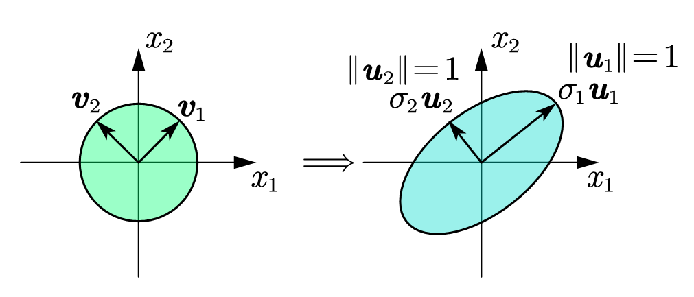

# Singular Value Decomposition (SVD)

## SVD Fundamentals

### Unitary Matrix

[**Unitary matrix**](https://en.wikipedia.org/wiki/Unitary_matrix): $\boldsymbol{Q}$ is a unitary matrix if:

$$
\boldsymbol{QQ}^*=\mathbf{I}, \boldsymbol{Q}^*\boldsymbol{Q}=\mathbf{I}
$$

where $\boldsymbol{Q}^*$ is the *conjugate transpose* of $\boldsymbol{Q}$.

A unitary matrix satisfies $\left\| \boldsymbol{QA} \right\| _2=\left\| \boldsymbol{A} \right\| _2$, which means that a unitary transform does not change the 2-norm of a matrix. Similarly, it can also be verified that $\left\| \boldsymbol{QA} \right\| _F=\left\| \boldsymbol{A} \right\| _F$, which means that a unitary transform does not change the Frobenius norm of a matrix.

### Introduction to SVD

#### Introductory Example

`Example`: Let $\boldsymbol{A}\in \mathbb{R} ^{2\times 2}, \boldsymbol{A}:\mathbb{R} ^2\mapsto \mathbb{R} ^2$. What is the image of the unit disk of $\boldsymbol{A}$ ?

We get:

$$
\boldsymbol{Av}_1=\sigma _1\boldsymbol{u}_1;\boldsymbol{Av}_2=\sigma _2\boldsymbol{u}_2
$$

$$
\boldsymbol{A}\left[ \begin{matrix}
	\boldsymbol{v}_1&		\boldsymbol{v}_2\\
\end{matrix} \right] =\left[ \begin{matrix}
	\sigma _1\boldsymbol{u}_1&		\sigma _2\boldsymbol{u}_2\\
\end{matrix} \right] =\left[ \begin{matrix}
	\boldsymbol{u}_1&		\boldsymbol{u}_2\\
\end{matrix} \right] \cdot \left[ \begin{matrix}
	\sigma _1&		0\\
	0&		\sigma _2\\
\end{matrix} \right] 
$$

Let:

$$
\boldsymbol{V}=\left[ \begin{matrix}
	\boldsymbol{v}_1&		\boldsymbol{v}_2\\
\end{matrix} \right] , \boldsymbol{U}=\left[ \begin{matrix}
	\boldsymbol{u}_1&		\boldsymbol{u}_2\\
\end{matrix} \right] , \mathbf{\Sigma }=\left[ \begin{matrix}
	\sigma _1&		0\\
	0&		\sigma _2\\
\end{matrix} \right] 
$$

We can get:

$$
\boldsymbol{AV}=\boldsymbol{U}\mathbf{\Sigma }
$$

where

$$
\boldsymbol{VV}^*=\mathbf{I}, \boldsymbol{UU}^*=\mathbf{I}
$$

Then $\boldsymbol{A}=\boldsymbol{AVV}^*=\boldsymbol{U}\mathbf{\Sigma }\boldsymbol{V}^*$.

#### Definition and Basic Theorem

The **Singular Value Decomposition (SVD)** is:

$$
\boldsymbol{A}=\boldsymbol{U}\mathbf{\Sigma }\boldsymbol{V}^*
$$

where $\boldsymbol{U}\in \mathbb{C} ^{m\times m}$ is a complex unitary matrix, $\mathbf{\Sigma }\in \mathbb{R} ^{m\times n}$ is a rectangular diagonal matrix with non-negative real numbers on the diagonal, and $\boldsymbol{V}\in \mathbb{C} ^{n\times n}$ is a complex unitary matrix. ($\boldsymbol{A}\in \mathbb{C} ^{m\times n}$ is a complex matrix)

The diagonal entries $\sigma _i=\Sigma _{ii}$ of $\mathbf{\Sigma }$ are uniquely determined by $\boldsymbol{A}$ and are called **singular values** of $\boldsymbol{A}$.

`Theorem`(Existence and Uniqueness): Every matrix $\boldsymbol{A}\in \mathbb{C} ^{m\times n}$ has a SVD. The singular values are uniquely determined. If $\boldsymbol{A}$ is square and $\sigma _j$ are distinct, the left and right singular vectors $\boldsymbol{u}_i,\boldsymbol{v}_i$ are uniquely determined up to a complex sign (complex number with modular one).

#### Properties of SVD

From:

$$
\boldsymbol{A}^*\boldsymbol{A}=\left( \boldsymbol{U}\mathbf{\Sigma }\boldsymbol{V}^* \right) ^*\cdot \boldsymbol{U}\mathbf{\Sigma }\boldsymbol{V}^*
$$

$$
=\left( \boldsymbol{V}\mathbf{\Sigma }^*\boldsymbol{U}^* \right) \boldsymbol{U}\mathbf{\Sigma }\boldsymbol{V}^*=\boldsymbol{V}\mathbf{\Sigma }^2\boldsymbol{V}^*=\boldsymbol{V}\mathbf{\Sigma }^2\boldsymbol{V}^{-1}
$$

We know that ${\sigma _i}^2$ is the eigenvalue of $\boldsymbol{A}^*\boldsymbol{A}$.

We can also get $\mathrm{rank}\left( \boldsymbol{A} \right)$ is the number of *non-zero elements* of singular values.

Furthermore, $\left\| \boldsymbol{A} \right\| _2=\sigma _1$ (largest singular value) if $\sigma _1\geqslant \sigma _2\geqslant \cdots \geqslant \sigma _r$.

Also:

$$
\left\| \boldsymbol{A} \right\| _F=\left( \sum_{i=1}^r{{\sigma _i}^2} \right) ^{\frac{1}{2}}
$$

If $\boldsymbol{A}\in \mathbb{R} ^{m\times m}$, then:

$$
\left| \det \left( \boldsymbol{A} \right) \right|=\prod_{i=1}^m{\sigma _i}
$$

## SVD Computation

From:

$$
\boldsymbol{A}=\boldsymbol{U}\mathbf{\Sigma }\boldsymbol{V}^*
$$

We can get:

$$
\boldsymbol{A}^*\boldsymbol{A}=\boldsymbol{V}\underset{\boldsymbol{D}}{\underbrace{\mathbf{\Sigma }^*\mathbf{\Sigma }}}\boldsymbol{V}^*
$$

as the eigenvalue decomposition of $\boldsymbol{A}^*\boldsymbol{A}$. $\boldsymbol{A}^*\boldsymbol{A}$ is called **normal matrix**.

Similar to eigenvalue decomposition, SVD computation has to be iterative!

SVD is computed in two phases as well.

### Phase One

**Phase 1** (Different from eigenvalue decomposition, there is no similarity requirement here): We convert $\boldsymbol{A}$ into a [bidiagonal matrix](https://en.wikipedia.org/wiki/Bidiagonal_matrix).

The algorithm is called **Golub-Kahan bidiagonalization**.

`Example`:

$$
\boldsymbol{A}=\left[ \begin{matrix}
	\times&		\times&		\times&		\times\\
	\times&		\times&		\times&		\times\\
	\times&		\times&		\times&		\times\\
	\times&		\times&		\times&		\times\\
	\times&		\times&		\times&		\times\\
\end{matrix} \right] \xrightarrow{{\boldsymbol{U}_1}^*}\left[ \begin{matrix}
	\times&		\times&		\times&		\times\\
	0&		\times&		\times&		\times\\
	0&		\times&		\times&		\times\\
	0&		\times&		\times&		\times\\
	0&		\times&		\times&		\times\\
\end{matrix} \right] \xrightarrow[\boldsymbol{V}_1]{}\left[ \begin{matrix}
	\times&		\times&		0&		0\\
	0&		\times&		\times&		\times\\
	0&		\times&		\times&		\times\\
	0&		\times&		\times&		\times\\
	0&		\times&		\times&		\times\\
\end{matrix} \right] 
$$

$$
\xrightarrow{{\boldsymbol{U}_2}^*}\left[ \begin{matrix}
	\times&		\times&		0&		0\\
	0&		\times&		\times&		\times\\
	0&		0&		\times&		\times\\
	0&		0&		\times&		\times\\
	0&		0&		\times&		\times\\
\end{matrix} \right] \xrightarrow[\boldsymbol{V}_2]{}\left[ \begin{matrix}
	\times&		\times&		0&		0\\
	0&		\times&		\times&		0\\
	0&		0&		\times&		\times\\
	0&		0&		\times&		\times\\
	0&		0&		\times&		\times\\
\end{matrix} \right] 
$$

$$
\xrightarrow{{\boldsymbol{U}_3}^*}\left[ \begin{matrix}
	\times&		\times&		0&		0\\
	0&		\times&		\times&		0\\
	0&		0&		\times&		\times\\
	0&		0&		0&		\times\\
	0&		0&		0&		\times\\
\end{matrix} \right] \xrightarrow[\boldsymbol{V}_3]{}\left[ \begin{matrix}
	\times&		\times&		0&		0\\
	0&		\times&		\times&		0\\
	0&		0&		\times&		\times\\
	0&		0&		0&		\times\\
	0&		0&		0&		\times\\
\end{matrix} \right] \xrightarrow{{\boldsymbol{U}_4}^*}\left[ \begin{matrix}
	\times&		\times&		0&		0\\
	0&		\times&		\times&		0\\
	0&		0&		\times&		\times\\
	0&		0&		0&		\times\\
	0&		0&		0&		0\\
\end{matrix} \right] 
$$

We can get the upper bidiagonal matrix. The work for Golub-Kahan bidiagonalization is $O\left( 4mn^2-\frac{4}{3}n^3 \right)$ flops.

Another method is called **Lawson-Hanson-Chan** algorithm. This is more efficient when $m\gg n$.

### Phase Two

**Phase 2**: Assume $\boldsymbol{A}$ is bidiagonal. Phase 2 must be an iterative procedure. Let $\sigma _k=\sqrt{\lambda _k}$, where $\lambda _k$ is an eigenvalue of $\boldsymbol{A}^*\boldsymbol{A}$. 

#### Regular Method

A *natural strategy* is:

1. Form $\boldsymbol{A}^*\boldsymbol{A}$;
2. Compute $\boldsymbol{A}^*\boldsymbol{A}=\boldsymbol{V}\mathbf{\Lambda }\boldsymbol{V}^*$;
3. $\sqrt{\mathbf{\Lambda }}=\mathbf{\Sigma }$ (component-wise square root);
4. Determine $\boldsymbol{U}=\boldsymbol{AV}\mathbf{\Sigma }^{-1}$.

This does work well in certain cases, but not so much in other cases!

Denote $\tilde{\sigma}_k$ as the computed singular value: $\tilde{\sigma}_k=\sqrt{\tilde{\lambda}_k}$.

`Claim`: $\left| \tilde{\sigma}_k-\sigma _k \right|=O\left( \frac{\left\| \boldsymbol{A} \right\| ^2}{\sigma _k}\varepsilon _{\mathrm{machine}} \right)$.

`Proof`:

[**Bauer–Fike theorem**](https://en.wikipedia.org/wiki/Bauer%E2%80%93Fike_theorem) states that:

$$
\left| \lambda _k\left( \boldsymbol{A}^*\boldsymbol{A}+\delta \boldsymbol{B} \right) -\lambda _k\left( \boldsymbol{A}^*\boldsymbol{A} \right) \right|\leqslant \left\| \delta \boldsymbol{B} \right\| _2
$$

Therefore, eigenvalue is a continuous function. Also $\left| \sigma _k\left( \boldsymbol{A}+\delta \boldsymbol{A} \right) -\sigma _k\boldsymbol{A} \right|\leqslant \left\| \delta \boldsymbol{A} \right\| _2$.

If $\tilde{\lambda}_k$ is computed by a stable method, then:

$$
\left| \tilde{\lambda}_k-\lambda _k \right|\leqslant \left\| \delta \boldsymbol{B} \right\| _2;
$$

$$
\frac{\left\| \delta \boldsymbol{B} \right\| _2}{\left\| \boldsymbol{A}^*\boldsymbol{A} \right\| _2}\leqslant O\left( \varepsilon _{\mathrm{machine}} \right) 
$$

Then:

$$
\left| \tilde{\lambda}_k-\lambda _k \right|\leqslant O\left( \left\| \boldsymbol{A}^*\boldsymbol{A} \right\| _2\cdot \varepsilon _{\mathrm{machine}} \right) 
$$

Take the square root:

$$
\left| \tilde{\sigma}_k-\sigma _k \right|=\left| \sqrt{\tilde{\lambda}_k}-\sqrt{\lambda _k} \right|=\left| \frac{\tilde{\lambda}_k-\lambda _k}{\sqrt{\tilde{\lambda}_k}+\sqrt{\lambda _k}} \right|=O\left( \frac{\left| \tilde{\lambda}_k-\lambda _k \right|}{2\sqrt{\lambda _k}} \right) 
$$

$$
\leqslant O\left( \frac{\left\| \boldsymbol{A}^*\boldsymbol{A} \right\| _2\varepsilon _{\mathrm{machine}}}{2\sigma _k} \right) \approx O\left( \frac{{\left\| \boldsymbol{A} \right\| _2}^2}{\sigma _k}\varepsilon _{\mathrm{machine}} \right) 
$$

We end the proof.

***Note***: If $\sigma _k\sim {\left\| \boldsymbol{A} \right\| _2}^2$, the computation is accurate. But if $\sigma _k\ll {\left\| \boldsymbol{A} \right\| _2}^2$, this is not a good strategy.

#### Better Method

If $\frac{{\left\| \boldsymbol{A} \right\| _2}^2}{\sigma _k}$ is large, is there a better way to compute the SVD is phase 2? The answer is yes.

Form a matrix:

$$
\boldsymbol{H}=\left[ \begin{matrix}
	\boldsymbol{O}&		\boldsymbol{A}^*\\
	\boldsymbol{A}&		\boldsymbol{O}\\
\end{matrix} \right] 
$$

Note that $\boldsymbol{A}=\boldsymbol{U}\mathbf{\Sigma }\boldsymbol{V}^*, \boldsymbol{A}^*=\boldsymbol{V}\mathbf{\Sigma }^*\boldsymbol{U}^*$. We can verify:

$$
\left[ \begin{matrix}
	\boldsymbol{O}&		\boldsymbol{A}^*\\
	\boldsymbol{A}&		\boldsymbol{O}\\
\end{matrix} \right] \left[ \begin{matrix}
	\boldsymbol{V}&		\boldsymbol{V}\\
	\boldsymbol{U}&		-\boldsymbol{U}\\
\end{matrix} \right] =\left[ \begin{matrix}
	\boldsymbol{V}&		\boldsymbol{V}\\
	\boldsymbol{U}&		-\boldsymbol{U}\\
\end{matrix} \right] \left[ \begin{matrix}
	\mathbf{\Sigma }&		\boldsymbol{O}\\
	\boldsymbol{O}&		-\mathbf{\Sigma }\\
\end{matrix} \right] ;
$$

$$
\left[ \begin{matrix}
	\boldsymbol{V}^*&		\boldsymbol{U}^*\\
	\boldsymbol{V}^*&		-\boldsymbol{U}^*\\
\end{matrix} \right] \left[ \begin{matrix}
	\boldsymbol{V}&		\boldsymbol{V}\\
	\boldsymbol{U}&		-\boldsymbol{U}\\
\end{matrix} \right] =\left[ \begin{matrix}
	\boldsymbol{V}^*\boldsymbol{V}+\boldsymbol{U}^*\boldsymbol{U}&		\boldsymbol{O}\\
	\boldsymbol{O}&		\boldsymbol{V}^*\boldsymbol{V}+\boldsymbol{U}^*\boldsymbol{U}\\
\end{matrix} \right] 
$$

This helps with the eigenvalue decomposition of $\boldsymbol{H}$. The singular values of $\boldsymbol{A}$ are the absolute values of the eigenvalues of $\boldsymbol{H}$. Therefore, the eigenvalues of $\boldsymbol{H}$ give the singular values of $\boldsymbol{A}$.
