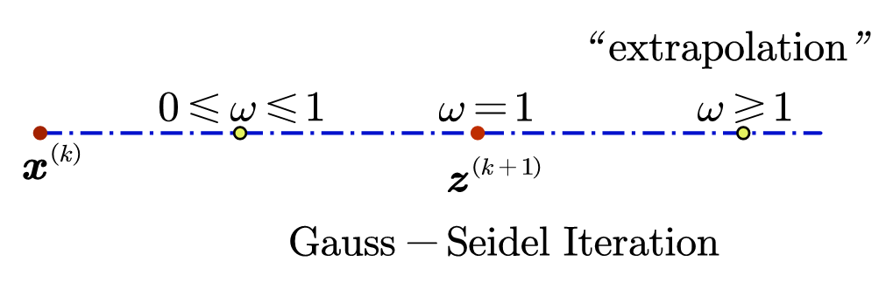

# Classical Iterative Methods

We cover three strategies of Classical Iterations: *Jacobi*, *Gauss-Seidel* and *SOR(Successive Over-Relaxation)* method.

`Task`: Solve linear system $\boldsymbol{Ax}=\boldsymbol{b}$.

`Strategy`: Iterate $\boldsymbol{x}^{\left( 0 \right)}\rightarrow \boldsymbol{x}^{\left( 1 \right)}\rightarrow \boldsymbol{x}^{\left( 2 \right)}\rightarrow \cdots \rightarrow \boldsymbol{x}^{\left( k \right)}\rightarrow \boldsymbol{x}^{\left( k+1 \right)}\rightarrow \cdots$

## Jacobi Iteration

### Component-wise Viewpoint

Let us discuss the ***component-wise viewpoint*** (good for coding) of **Jacobi Iteration**.

We examine $i$ -th equation in $\boldsymbol{Ax}=\boldsymbol{b}$:

$$
a_{i1}x_1+a_{i2}x_2+\cdots +a_{ii}x_i+\cdots +a_{im}x_m=b_i,
$$

$$
a_{ii}x_i+\left( \sum_{j=1}^{i-1}{a_{ij}x_j}+\sum_{j=i+1}^m{a_{ij}x_j} \right) =b_i
$$

Assume $x_j\ (j\ne i)$ are known (as the current approximation), we have:

$$
a_{ii}{x_i}^{\left( k+1 \right)}=b_i-\left( \sum_{j=1}^{i-1}{a_{ij}{x_j}^{\left( k \right)}}+\sum_{j=i+1}^m{a_{ij}{x_j}^{\left( k \right)}} \right) 
$$

If $a_{ii} \ne 0$, then:

$$
{x_i}^{\left( k+1 \right)}=\frac{1}{a_{ii}}\left[ b_i-\sum_{j\ne i}{a_{ij}{x_j}^{\left( k \right)}} \right] ; i=1,2,\cdots ,m
$$

This is the formula for Jacobi Iteration.

### Matrix Viewpoint

Let us now discuss the ***matrix viewpoint*** (good for analysis) of Jacobi Iteration.

We split $\boldsymbol{A}$ as:

$$
\boldsymbol{A}=\left[ \begin{matrix}
	\ddots&		&		-\boldsymbol{F}\\
	&		\boldsymbol{D}&		\\
	-\boldsymbol{E}&		&		\ddots\\
\end{matrix} \right] =\boldsymbol{D}-\boldsymbol{E}-\boldsymbol{F}
$$

where $\boldsymbol{D}$ is the diagonal part of $\boldsymbol{A}$, and $\boldsymbol{E}$ and $\boldsymbol{F}$ are the lower triangular part and upper triangular part of negative $\boldsymbol{A}$. Then:

$$
\boldsymbol{Ax}=\boldsymbol{b}\Longleftrightarrow \left( \boldsymbol{D}-\boldsymbol{E}-\boldsymbol{F} \right) \boldsymbol{x}=\boldsymbol{b};
$$

$$
\boldsymbol{Dx}=\boldsymbol{b}+\left( \boldsymbol{E}+\boldsymbol{F} \right) \boldsymbol{x}
$$

We get:

$$
\boldsymbol{Dx}^{\left( k+1 \right)}=\boldsymbol{b}+\left( \boldsymbol{E}+\boldsymbol{F} \right) \boldsymbol{x}^{\left( k \right)}
$$

If $\boldsymbol{D}$ is invertible, we have:

$$
\boldsymbol{x}^{\left( k+1 \right)}=\boldsymbol{D}^{-1}\left[ \boldsymbol{b}+\left( \boldsymbol{E}+\boldsymbol{F} \right) \boldsymbol{x}^{\left( k \right)} \right] 
$$

This is the matrix representation for Jacobi Iteration.

## Gauss-Seidel Iteration

Using the most updated values for ${x_j}^{\left( k \right)}$, we have the algorithm below:

For $i=1,2 \cdots , m$:

$$
{x_i}^{\left( k+1 \right)}=\frac{1}{a_{ii}}\left[ b_i-\left( \sum_{j=1}^{i-1}{a_{ij}{x_j}^{\left( k+1 \right)}}+\sum_{j=i+1}^m{a_{ij}{x_j}^{\left( k \right)}} \right) \right] 
$$

End

This is **Gauss-Seidel Iteration**.

From:

$$
\boldsymbol{Ax}=\boldsymbol{b}\Longleftrightarrow \left( \boldsymbol{D}-\boldsymbol{E} \right) \boldsymbol{x}=\boldsymbol{b}+\boldsymbol{Fx};
$$

$$
\boldsymbol{x}=\left( \boldsymbol{D}-\boldsymbol{E} \right) ^{-1}\left( \boldsymbol{b}+\boldsymbol{Fx} \right) 
$$

We get:

$$
\boldsymbol{x}^{\left( k+1 \right)}=\left( \boldsymbol{D}-\boldsymbol{E} \right) ^{-1}\left( \boldsymbol{b}+\boldsymbol{Fx}^{\left( k \right)} \right) 
$$

This is the matrix expression for Gauss-Seidel Iteration.

We have another option:

$$
\boldsymbol{x}^{\left( k+1 \right)}=\left( \boldsymbol{D}-\boldsymbol{F} \right) ^{-1}\left( \boldsymbol{b}+\boldsymbol{Ex}^{\left( k \right)} \right) 
$$

What is the component-wise formula for this option?

`Note`: **Symmetric Gauss-Seidel Iteration** iterates $i=1,2,\cdots ,m-1,m$ , followed by $i=m,m-1,\cdots ,2,1$.

## Successive Over-Relaxation (SOR)

### Introduction to SOR

Pick $\omega \ne 0$. For $\boldsymbol{Ax}=\boldsymbol{b}$, we have:

$$
\omega \boldsymbol{Ax}=\omega \boldsymbol{b};
$$

$$
\omega \boldsymbol{A}=\left( \boldsymbol{D}-\omega \boldsymbol{E} \right) -\left[ \omega \boldsymbol{F}+\left( 1-\omega \right) \boldsymbol{D} \right] ;
$$

$$
\boldsymbol{x}=\left( \boldsymbol{D}-\omega \boldsymbol{E} \right) ^{-1}\cdot \left[ w\boldsymbol{b}+\left[ \omega \boldsymbol{F}+\left( 1-\omega \right) \boldsymbol{D} \right] \cdot \boldsymbol{x} \right] 
$$

Thus:

$$
\boldsymbol{x}^{\left( k+1 \right)}=\left( \boldsymbol{D}-\omega \boldsymbol{E} \right) ^{-1}\cdot \left[ w\boldsymbol{b}+\left[ \omega \boldsymbol{F}+\left( 1-\omega \right) \boldsymbol{D} \right] \cdot \boldsymbol{x}^{\left( k \right)} \right] 
$$

This is the matrix representation of SOR iteration.

What is the component-wise formula for SOR?

$$
{x_i}^{\left( k+1 \right)}=\left( 1-\omega \right) {x_i}^{\left( k \right)}+\frac{\omega}{a_{ii}}\left( b_i-\sum_{j<i}{a_{ij}{x_j}^{\left( k+1 \right)}}-\sum_{j>i}{a_{ij}{x_j}^{\left( k \right)}} \right) ; i=1,2,\cdots ,m
$$

### Discussion on SOR

Geometric explanation of SOR:

$$
\boldsymbol{x}^{\left( k+1 \right)}=\omega \boldsymbol{z}^{\left( k+1 \right)}+\left( 1-\omega \right) \boldsymbol{x}^{\left( k \right)}
$$

When $\omega \in \left( 1,2 \right)$, it is called **Over-Relaxation**.

When $\omega$ is picked as the so-called ***optimal relaxation parameter***, SOR outperforms Jacobi or Gauss-Seidel significantly.

$$
\omega _{\mathrm{optimal}}=\frac{2}{1+\sqrt{1-\rho ^2\left( \boldsymbol{G} \right)}}
$$

where $\boldsymbol{G}$ is the ***iterative matrix*** of Jacobi Iteration, and $\rho \left( \boldsymbol{G} \right)$ is the ***spectral radius*** of $\boldsymbol{G}$

This formula is rarely used. In practice, we use trial and error to find $\omega$.
