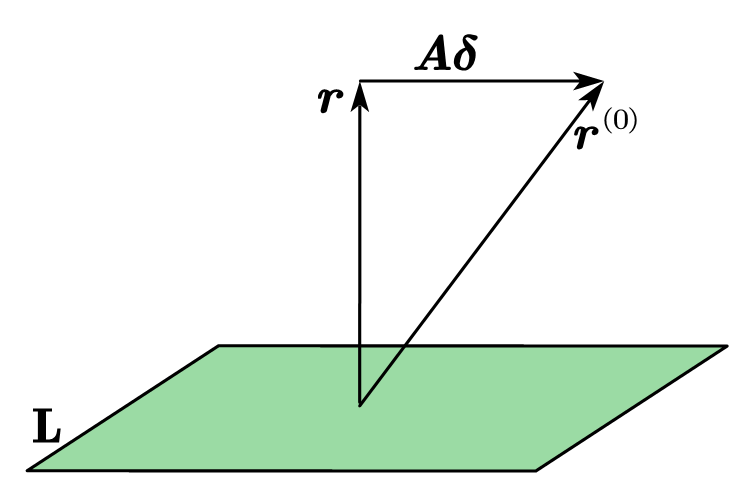

# Projection Methods

## General framework for Projection Methods

Given two subspaces $\mathbf{L},\mathbf{K}$, and an initial guess for the solution $\boldsymbol{x}^{\left( 0 \right)}$, we want to find $\boldsymbol{\delta }\in \mathbf{K}$ such that $\boldsymbol{x}=\boldsymbol{x}^{\left( 0 \right)}+\boldsymbol{\delta }$ produces a ***residual*** $\boldsymbol{r}=\boldsymbol{b}-\boldsymbol{Ax}$ that is orthogonal to $\mathbf{L}$.

$$
\boldsymbol{r}=\boldsymbol{b}-\boldsymbol{Ax}=\boldsymbol{b}-\boldsymbol{A}\left( \boldsymbol{x}^{\left( 0 \right)}+\boldsymbol{\delta } \right) 
$$

$$
=\left( \boldsymbol{b}-\boldsymbol{Ax}^{\left( 0 \right)} \right) -\boldsymbol{A\delta }=\boldsymbol{r}^{\left( 0 \right)}-\boldsymbol{A\delta };
$$

Note that:

$$
\boldsymbol{r}\bot \mathbf{L}
$$

Assume $\boldsymbol{x}\in \mathbb{R} ^m\left( n\leqslant m \right)$. Let $\left\{ \boldsymbol{v}_i \right\} _{i=1}^{n}$ be a *basis* of $\mathbf{K}$, and let $\left\{ \boldsymbol{w}_i \right\} _{i=1}^{n}$ be a *basis* of $\mathbf{L}$. Note that we assume $\mathrm{dim}\left( \mathbf{K} \right) =\mathrm{dim}\left( \mathbf{L} \right)$ here. Then:

$$
\boldsymbol{r}\bot \mathbf{L}\ \ \Leftrightarrow \ \ \boldsymbol{r}\bot \boldsymbol{w}_i,\ \left( i=1,2,\cdots ,n \right) ;
$$

$$
\left< \boldsymbol{w}_i,\ \boldsymbol{r} \right> =0,\ \left( i=1,2,\cdots ,n \right) 
$$

If we denote:

$$
\boldsymbol{W}=\left[ \begin{matrix}
	\boldsymbol{w}_1&		\cdots&		\boldsymbol{w}_n\\
\end{matrix} \right];
$$

$$
\boldsymbol{V}=\left[ \begin{matrix}
	\boldsymbol{v}_1&		\cdots&		\boldsymbol{v}_n\\
\end{matrix} \right] 
$$

Then:

$$
\boldsymbol{W}^T\boldsymbol{r}=\mathbf{0}
$$

For $\boldsymbol{\delta }\in \mathbf{K}$, we have:

$$
\boldsymbol{\delta }=\sum_{i=1}^n{y_i\boldsymbol{v}_i}=\boldsymbol{Vy};\ \boldsymbol{y}=\left[ \begin{array}{c}
	y_1\\
	\vdots\\
	y_n\\
\end{array} \right] 
$$

We get:

$$
\boldsymbol{x}=\boldsymbol{x}^{\left( 0 \right)}+\boldsymbol{\delta }=\boldsymbol{x}^{\left( 0 \right)}+\boldsymbol{Vy};
$$

$$
\boldsymbol{r}=\boldsymbol{b}-\boldsymbol{Ax}=\boldsymbol{r}^{\left( 0 \right)}-\boldsymbol{A\delta }=\boldsymbol{r}^{\left( 0 \right)}-\boldsymbol{AVy};
$$

$$
\mathbf{0}=\boldsymbol{W}^T\boldsymbol{r}=\boldsymbol{W}^T\left( \boldsymbol{r}^{\left( 0 \right)}-\boldsymbol{AVy} \right) =\boldsymbol{W}^T\boldsymbol{r}^{\left( 0 \right)}-\boldsymbol{W}^T\boldsymbol{AVy};
$$

Then:

$$
\boldsymbol{W}^T\boldsymbol{AVy}=\boldsymbol{W}^T\boldsymbol{r}^{\left( 0 \right)}
$$

Therefore, if $\boldsymbol{W}^T\boldsymbol{AV}$ is *invertible* (note that we have assumed the dimensions of $\mathbf{K}$ and $\mathbf{L}$ are the same before), we get:

$$
\boldsymbol{y}=\left( \boldsymbol{W}^T\boldsymbol{AV} \right) ^{-1}\boldsymbol{W}^T\boldsymbol{r}^{\left( 0 \right)}
$$

where $\boldsymbol{W}^T\boldsymbol{AV}$ is a $n\times n$ matrix (in many cases, we select $n$ as a small number; sometimes even $n=1$). Then:

$$
\boldsymbol{x}=\boldsymbol{x}^{\left( 0 \right)}+\boldsymbol{\delta }=\boldsymbol{x}^{\left( 0 \right)}+\boldsymbol{Vy}
$$

$$
=\boldsymbol{x}^{\left( 0 \right)}+\boldsymbol{V}\left( \boldsymbol{W}^T\boldsymbol{AV} \right) ^{-1}\boldsymbol{W}^T\boldsymbol{r}^{\left( 0 \right)}
$$

`Algorithm`( **Projection Algorithm** ):

Until convergence, do:

- Select a pair of subspaces $\mathbf{K},\mathbf{L}$;
- Choose bases $\boldsymbol{V}=\left[ \begin{matrix}
	\boldsymbol{v}_1&		\cdots&		\boldsymbol{v}_n\\
\end{matrix} \right] , \boldsymbol{W}=\left[ \begin{matrix}
	\boldsymbol{w}_1&		\cdots&		\boldsymbol{w}_n\\
\end{matrix} \right]$;
- $\boldsymbol{r}=\boldsymbol{b}-\boldsymbol{Ax}$;
- $\boldsymbol{y}=\left( \boldsymbol{W}^T\boldsymbol{AV} \right) ^{-1}\boldsymbol{W}^T\boldsymbol{r}$;
- $\boldsymbol{x}=\boldsymbol{x}+\boldsymbol{Vy}$;

End

## Example: Gauss-Seidel Method

`Example`: Gauss-Seidel is a Projection Method by taking $\mathbf{K}=\mathbf{L}=\mathrm{span}\left\{ \boldsymbol{e}_i \right\}$ (standard basis). In this case:

$$
\boldsymbol{\delta }=\left[ \begin{array}{c}
	0\\
	\vdots\\
	0\\
	\delta _i\\
	0\\
	\vdots\\
	0\\
\end{array} \right] , \boldsymbol{x}=\boldsymbol{x}^{\left( 0 \right)}+\boldsymbol{\delta }=\left[ \begin{array}{c}
	{\boldsymbol{x}_1}^{\left( 0 \right)}\\
	\vdots\\
	{\boldsymbol{x}_i}^{\left( 0 \right)}\\
	\vdots\\
	{\boldsymbol{x}_n}^{\left( 0 \right)}\\
\end{array} \right] +\left[ \begin{array}{c}
	0\\
	\vdots\\
	0\\
	\delta _i\\
	0\\
	\vdots\\
	0\\
\end{array} \right] ;
$$

And:

$$
\boldsymbol{r}=\boldsymbol{b}-\boldsymbol{Ax}=\boldsymbol{b}-\boldsymbol{Ax}^{\left( 0 \right)}-\boldsymbol{A\delta }=\boldsymbol{r}^{\left( 0 \right)}-\boldsymbol{A\delta };
$$

Note that we require:

$$
\boldsymbol{r}\bot \mathbf{L}\Leftrightarrow \boldsymbol{r}\bot \boldsymbol{e}_i;
$$

$$
0={\boldsymbol{e}_i}^T\boldsymbol{r}=\left( \boldsymbol{b}-\boldsymbol{Ax}^{\left( 0 \right)}-\boldsymbol{A\delta } \right) _i=0;
$$

$$
b_i-\sum_{j=1}^m{a_{ij}{x_j}^{\left( 0 \right)}}-a_{ii}\delta _i=0,
$$

$$
\delta _i=\frac{1}{a_{ii}}\left( b_i-\sum_{j=1}^m{a_{ij}{x_j}^{\left( 0 \right)}} \right) 
$$

We end up with Gauss-Seidel iteration.

## Discussion on Projection Method

Now, consider the projection method again:

$$
\begin{cases}
	\boldsymbol{r}=\boldsymbol{b}-\boldsymbol{Ax}\\
	\boldsymbol{y}=\left( \boldsymbol{W}^T\boldsymbol{AV} \right) ^{-1}\boldsymbol{W}^T\boldsymbol{r}\\
	\boldsymbol{x}=\boldsymbol{x}+\boldsymbol{Vy}\\
\end{cases}
$$

The algorithm can be *continued* (does not necessarily mean convergence) if $\boldsymbol{W}^T\boldsymbol{AV}$ is ***invertible***.

`Question`: How do we ensure that $\boldsymbol{W}^T\boldsymbol{AV}$ is invertible?

If $\boldsymbol{A}$ is invertible, it is not necessarily true that $\boldsymbol{W}^T\boldsymbol{AV}$ is also invertible. For example, consider:

$$
\boldsymbol{A}=\left[ \begin{matrix}
	\boldsymbol{O}&		\mathbf{I}_{\left( \mathrm{r}\ \mathrm{rows} \right)}\\
	\mathbf{I}_{\left( \mathrm{r}\ \mathrm{cols} \right)}&		\mathbf{I}\\
\end{matrix} \right] , \boldsymbol{V}=\boldsymbol{W}=\left[ \begin{array}{c}
	\mathbf{I}\\
	\boldsymbol{O}\\
\end{array} \right] ;
$$

$$
\Rightarrow \boldsymbol{W}^T\boldsymbol{AV}=\boldsymbol{O}
$$

`Theorem`: Let $\boldsymbol{A},\mathbf{L},\mathbf{K}$ satisfy either *one* of the following conditions:

1. $\boldsymbol{A}$ is **SPD** and $\mathbf{L}=\mathbf{K}$;
2. $\boldsymbol{A}$ is **invertible** and $\mathbf{L}=\boldsymbol{A} \mathbf{K}$.

Then the matrix $\boldsymbol{W}^T\boldsymbol{AV}$ is nonsingular for any $\boldsymbol{V}, \boldsymbol{W}$ of $\mathbf{K},\mathbf{L}$ respectively.

`Proof`: $\mathbf{L}=\boldsymbol{A} \mathbf{K}$ means that $\forall \boldsymbol{v}\in \mathbf{K}, \boldsymbol{Av}\in \mathbf{L}$, and $\forall \boldsymbol{u}\in \mathbf{L}$, there exists $\boldsymbol{v}\in \mathbf{K}$ such that $\boldsymbol{u}=\boldsymbol{Av}$.

***First situation***: Since $\mathbf{L}=\mathbf{K}$, and $\boldsymbol{V},\boldsymbol{W}$ are the two bases, then $\boldsymbol{W}=\boldsymbol{VG}$, where $\boldsymbol{G}$ is the *change of basis matrix* ( $\boldsymbol{G}$ is invertible). We can find out that:

$$
\boldsymbol{W}^T\boldsymbol{AV}=\left( \boldsymbol{VG} \right) ^T\boldsymbol{AV}=\underset{\mathrm{invertible}}{\underbrace{\boldsymbol{G}^T}}\cdot \underset{\mathrm{invertible}}{\underbrace{\boldsymbol{V}^T\boldsymbol{AV}}}
$$

Then $\boldsymbol{W}^T\boldsymbol{AV}$ is invertible.

***Second situation***: Pick $\mathbf{L}=\boldsymbol{A} \mathbf{K}$, then $\boldsymbol{AV}$ is a basis for $\mathbf{L}$. Since $\boldsymbol{W}$ is also a basis for $\mathbf{L}$, there exists a change of basis matrix $\boldsymbol{G}$ (invertible) such that $\boldsymbol{AVG}=\boldsymbol{W}$. Then:

$$
\boldsymbol{W}^T\boldsymbol{AV}=\boldsymbol{G}^T\left( \boldsymbol{AV} \right) ^T\boldsymbol{AV}=\boldsymbol{G}^T\boldsymbol{V}^T\boldsymbol{A}^T\boldsymbol{AV}
$$

$\boldsymbol{A}^T\boldsymbol{A}$ is SPD because $\boldsymbol{A}$ is nonsingular. Since $\boldsymbol{V}^T\boldsymbol{A}^T\boldsymbol{AV}$ and $\boldsymbol{G}^T$ are invertible, we can find that $\boldsymbol{W}^T\boldsymbol{AV}$ is invertible.

Therefore, the projection method can be continued under one of these two conditions. End of proof.

`Example`: Assume $\boldsymbol{A}$ is SPD, pick $\mathbf{L}=\mathbf{K}$. Let $\mathbf{K}=\mathbf{L}=\mathrm{span}\left\{ \boldsymbol{r}^{\left( j \right)},\boldsymbol{p}^{\left( j-1 \right)} \right\}$ where $\boldsymbol{p}^{\left( j-1 \right)}$ is the search direction in the previous step and $\boldsymbol{r}^{\left( j \right)}$ is the current residual. This is how [Conjugate Gradient Method (CG)](./Conjugate_Gradient.md) is formed.
